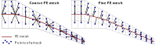
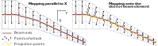
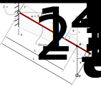

.. _sec_notes_on_beam_models:

Notes on beam models
====================

**TODO** See [Dett19]_

   Mapping of discretised aerodynamic forces onto the FE beam mesh according to the closest-node approach for a coarse and a fine FE mesh. When using a very fine FE discretisation, loads are practically projected perpendicular to the beam's elastic axis (image from [Dett19]_).

   Comparison of load mapping schemes for a swept wing (image from [Dett19]_)

   Projection of off-axis loads onto a cantilever beam inclined with respect to the global coordinate system. The global coordinate system (blue axes) and the beam-local coordinate system (green axes) do not coincide. The off-axis loads can be projected onto the beam axis either using a *parallel-to-X* or a *closest-element (closest-node) approach* (image from [Dett19]_).

TODO

.. note::

    This summary is based on/copied from [Dett19]_ with the authors permission.
