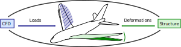
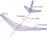

.. _sec_coupling:

Aeroelastic coupling
====================

Introduction
------------

Generally, one can distinguish between *monolithic* and *partitioned* solution methods for aeroelastic simulations. The so-called monolithic models formulate the governing equations including both fluid- and structural dynamics in a single system of equations, while partitioned methods are based on separate models for the structure and fluid domains. Felippa et al. [FePF01]_ give an extensive overview about the terminology, general concepts, techniques, merits and examples for the partitioned treatment of coupled mechanical systems. The terms monolithic and partitioned are used according to the definitions in [FePF01]_.

.. _fig_basic_aeroel_concept:

   Basic aeroelastic coupling concept in a partitioned approach. Separate solvers for the aerodynamic and structural analyses operate on a common aircraft model. A staggered solution procedure is used in which loads and deformations are updated alternatingly [Dett19]_.

One major advantage of the partitioned approach is that for each domain (fluid and structure) well established modelling-, discretisation- and solution methods can be applied [Brau07]_, [RBBW10]_, [Bouc03]_. The model presented in this work will be based on a partitioned solution method. In this approach, the separated fluid and structure domains have to be coupled in a suitable way, and a data exchange for loads and deformations has to be established. The general coupling concept is illustrated in :numref:`fig_basic_aeroel_concept`. The fluid and the structure domains are updated with an alternating scheme based on new estimates of deformations and loads, respectively. This general form of coupling is also known as staggering [FePF01]_, though time is considered to be fixed in this particular case. If a static equilibrium position exists, the load and displacement fields may converge in this iterative procedure.

The coupling of the separate fluid and structure solvers constitutes the central aspect of the partitioned solution approach. For a meaningful physical representation of the whole fluid-structure system, *coupling boundary conditions* in accordance with Newton's 3rd law have to be fulfilled [Brau07]_. The boundary conditions demand that both spatial and temporal deformations and loads must be equal at the fluid-structure interface. In other words, a suitable transfer must ensure that loads and deformations are equal at the boundary of the fluid and structure domain within a same time step. As this work is restricted to static analyses, temporal coupling boundary conditions do not apply. However, the spatial boundary conditions do apply and require that all aerodynamic loads must be transferred from the fluid to the structure domain, and that the work done by the fluid domain must equal the work done by the structure domain.

Braun [Brau07]_ gives a more detailed overview about the coupling boundary conditions for the general case of dynamic aeroelastic analyses. It should also be noted that various practical issues in the implementation of partitioned, modular, multi-fidelity, dynamic aeroelastic analyses have been covered in-depth by Reimer et al. [RBBW10]_, Braun [Brau07]_ and Boucke [Bouc03]_. Amongst others, issues such as mismatched discretisations, potential problems with load mappings and mesh deformations methods are being covered. Many of the issues and solution methods presented by these authors do apply in this work as well.

Example (VLM and beam FEM)
--------------------------

The conceptual idea of connecting a CFD_ and a structure model is illustrated in :numref:`fig_coupled_discretisations`. In the shown example, the vortex lattice method (VLM) is coupled with a FE beam model. While the VLM uses a surface mesh, the FE beam uses a line mesh. It is obvious that there is a mismatch in the discretisations of these two models. Thus, there has to be a scheme which transfers and interpolates loads computed by the VLM and deformations computed by the FE beam model.

.. _fig_coupled_discretisations:

   Concept of joining a VLM with a FE beam model. Aircraft components use different meshes for the aerodynamics and the structure analyses. For some components (e.g. the fuselage) there may not be a corresponding CFD mesh [Dett19]_.

.

.. note::

    This summary is based on/copied from [Dett19]_ with the authors permission.
