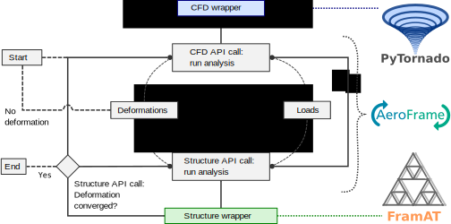

.. _sec_user_guide:

User guide
==========

What is |name|?
---------------

Computational aeroelastic analyses are often based on separate solvers for the aerodynamics and the structural analyses. In other words, aerodynamics may be analysed with a standalone CFD_ tool and the structural response is computed with a standalone FEM_ tool. To perform an aeroelastic analyses it is necessary to exchange data, namely *loads* computed by the CFD_ tool and *deformations* computed by the FEM_ tool.

|name| is a framwork which facilitates the exchange of load and deformation data, and it coordinates the separate aerodynamics and structure solvers. |name| performs a "*high-level* partitioned aeroelastic analyses". The actual aerodynamics and structure solvers have to be plugged into the framework. This is done using small wrapper modules, one for the CFD_ tool and one for the FEM_ tool. In order to use |name| it is only necessary to write two wrapper modules.

The following diagram illustrates the coupling, and a so-called *aeroelastic loop* which is solved to perform a *static aeroelastic analysis*. In this case, the CFD_ tool is *PyTornado* and the structure tool is *FramAT* (see also :ref:`sec_related_projects`), though both tools are representatives of any arbitrary CFD_ or structure tool.

   Conceptual implementation of the aeroelastic loop to find static equilibria [Dett19]_

The following pages describe the tool prerequisites, how the wrappers can be set up and how |name| is used.

.. toctree::
   :maxdepth: 1
   :caption: Getting started

   tool_prerequisites
   conventions
   wrappers
