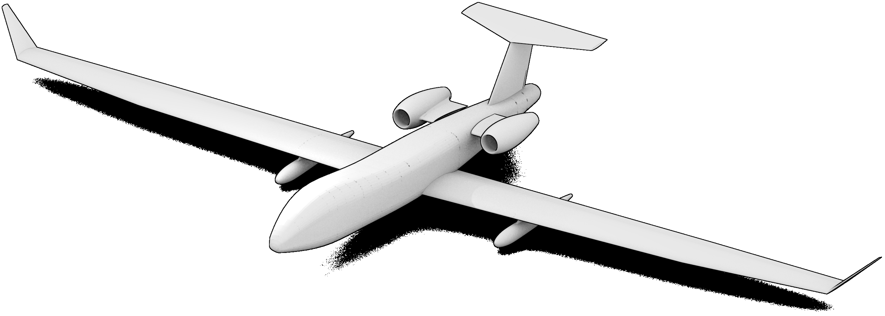
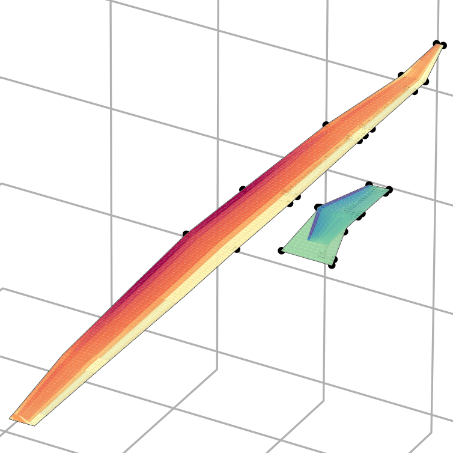
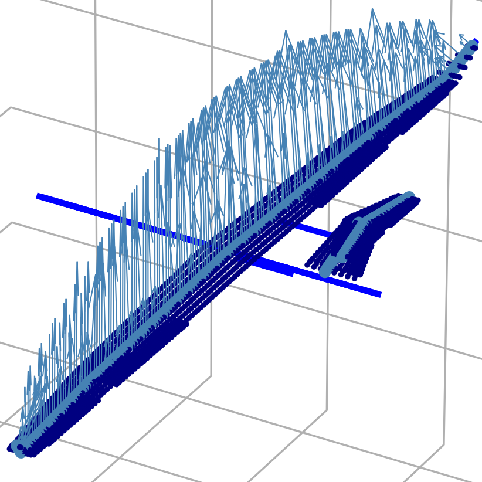
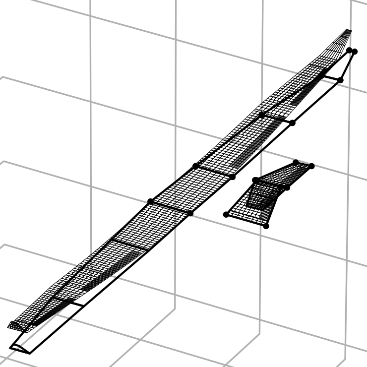

.. _sec_user_guide:

User guide
==========

What is |name|?
---------------

Computational aeroelastic analyses are often based on separate solvers for the aerodynamics and the structural analyses. In other words, aerodynamics may be analysed with a standalone CFD_ tool and the structural response is computed with a standalone FEM_ tool. To perform an aeroelastic analyses it is necessary to exchange data, namely *loads* computed by the CFD_ tool and *deformations* computed by the FEM_ tool.

|name| is a framwork which facilitates the exchange of load and deformation data, and it coordinates the separate aerodynamics and structure solvers. |name| performs "*high-level*" partitioned aeroelastic analyses and provides tools for load mapping and mesh deformations. The actual aerodynamics and structure solvers have to be plugged into the framework. This is done using small wrapper modules, one for the CFD_ tool and one for the FEM_ tool. In order to use |name| it is only necessary to write two wrapper modules.

The following diagram illustrates the coupling, and a so-called *aeroelastic loop* which is solved to perform a *static aeroelastic analysis*. In this case, the CFD_ tool is *PyTornado* and the structure tool is *FramAT* (see also :ref:`sec_related_projects`), though both tools are representatives of any arbitrary CFD_ or structure tool.

.. figure:: ../_static/images/aeroframe_concept.svg
   :width: 800 px
   :alt: Basic |name| concept
   :align: right

   Conceptual implementation of the aeroelastic loop to find static equilibria [Dett19]_

The loop is illustrated below for an aircraft (OptiMale UAV [AgOp19]_) in a pull-up manoeuvre. The analysis is described in more depth in [Dett19]_. *PyTornado* and *FramAT* were used as CFD_ and structure solvers, respectively (see also :ref:`sec_related_projects`).

   General arrangement of the OptiMale UAV [AgOp19]_

Starting from an undeformed state, a first CFD analysis is performed. The computed loads are shared within the framework. Subsequently, a structure analysis is performed. The previously shared loads are read and mapped onto the structure model. The computed deformations are again shared within framework. The deformation field is now accessible to the CFD analysis, thus the flow field for a deformed aircraft can be analysed. This loop of alternating aerodynamic and structure analyses including the sharing of loads and deformations is continued until the structural deformation has converged. [#]_ The tasks of interpreting and processing the shared loads and deformations are offloaded to the CFD and structure APIs.

.. [#] To prevent infinite loops due to non-convergent situations, the number of loops can be restricted.

|pic1| ___ |pic2|

*Loads in the 3g pull-up manoeuvre. (a) Qualitative pressure distribution in the undeformed state and (b) nodal loads after projection (nodal moments and inertia loads omitted)*

|pic3| ___ |pic4|

*Deformation in the 3g pull-up manoeuvre. (a) Deflection of the FE beam model and (b) deformed VLM mesh*

.. |pic3| image:: ../_static/images/optimale_example_loop/plot_c.png
   :width: 45%

.. note::

    This summary is based on/copied from [Dett19]_ with the authors permission.

The following pages describe the tool prerequisites, how the wrappers can be set up and how |name| is used.
