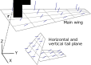
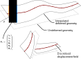

.. _sec_tool_prerequisites:

Tool prerequisites
==================

To plug a CFD_ or a FEM_ tool into |name| it needs to fulfil a few prerequisites which will be listed here. If they are fulfilled it is possible to write a wrapper module :ref:`sec_wrappers`.

Aerodynamics tool
-----------------

Discretised load field
~~~~~~~~~~~~~~~~~~~~~~

In |name|, lift and all other aerodynamic forces are thought of as a *discretised load field* acting around the aircraft's surface. In practice, only force vectors (and potentially moment vectors) as well as the corresponding points of attack are exchanged. The discretised load field must in some way represent the continuous pressure distribution acting around the aircraft.

The CFD_ tool which is to be used in |name| must be able to generate the output which is or can be converted into a discretised load field formulation. The exact output format does not matter since the CFD_ wrapper module can be used to convert and encapsulate the required format.

.. _fig_discr_load_field:

   Discretised load field. Here a VLM mesh is shown (image from [Dett19]_).

Mesh transformations
~~~~~~~~~~~~~~~~~~~~

The CFD_ tool must be able to analyse the airflow around a deformed structure. This requires to update the CFD_ mesh to reflect structural deformations. A discretised load field must be interpreted and interpolated as deformations of a CFD_ mesh.

Structure tool
--------------

Discretised deformation fields
~~~~~~~~~~~~~~~~~~~~~~~~~~~~~~

Similarly to the loads, structural displacements are exchanged in a discretised form. :numref:`fig_discr_deformation_field` illustrate this for a simple beam FEM_ mesh. The discretised deformation field consists of FEM_ node locations and the corresponding deformation at this particular node. In case of the shown beam mesh there is a position vector :math:`r_i` point to a node :math:`i` where there can be translational and rotational deformations.

.. _fig_discr_deformation_field:

   Discretised deformation field. Here a FEM_ beam mesh is shown (image from [Dett19]_).

A structure tool intended to be used in |name| must be able generate a full deformation field consisting of position vectors, and the nodal deformation.

Application of load fields
~~~~~~~~~~~~~~~~~~~~~~~~~~

The discretised load field described above must be applied to the structure.

Load and deformation grouping
-----------------------------

TODO

Notes on coupling boundary conditions
-------------------------------------

TODO
